# Building-an-Amazon-Virtual-Private-Cloud-VPC-Empowering-Secure-and-Scalable-Infrastructure-with-AWS


## Author:
Alex Navarro - Senior Business Intelligence Engineer

## 🔗 Contact Information
[](https://www.linkedin.com/in/alexnavarro2/)
[](https://mail.google.com/mail/u/0/#inbox?compose=GTvVlcSBpRjxKKJtxTLNxwpsKvpfbRSRnRLcTQRMZLcKCNfrJjXfcNNKPmstkbHJpzHGNZnHvhCph)

## Project Overview:
Build a VPC that includes a web server and an Amazon RDS database. Once both are created, connect the address book application running the web server to the Amazon RDS for MySQL instance.

## What is Amazon VPC?
https://docs.aws.amazon.com/vpc/latest/userguide/what-is-amazon-vpc.html

## What is a Classless Inter-Domain Routing "CIDR"?
The CIDR block represents the IP address range that I can assign to my VPC. It specifies the network address and the number of significant bits used for routing within that network. It enables resources in my the VPC to communicate with each other, and with resources over the internet.

https://docs.aws.amazon.com/vpc/latest/userguide/vpc-ip-addressing.html

### Create a VPC:
* Go to the VPC management console
* Create VPC
* Choose VPC Only
* Give VPC Name
* IPv4 CIDR Block = 10.0.0.0/16
* Click Create VPC:


We can see that my VPC has been created and now we can see the details configured for this specific VPC:


### Create Public Subnet:
Remember that public subnets allow our vpc to talk to the internet. Therefore, we need to make sure that our public subnet has a internet gateawy and auto assigned public IPv4 or IPv6. We also will need to create a public subnet routing table.

* Choose Create Subnet
* VPC ID = My VPC
* Subnet Name = Public 1
* AZ = Select first AZ
* IPv4 CIDR Block = 10.0.1.0/24

We can see the subnet has been created and shows the configuration details mentioned above:


Automatically request a public IPv4 address for a new network interface.

* Enable auto-assign public IPv4 address provides a public IPv4 address for all instances launched into the selected subnet.

    * Go to the Actions drop down then select "Edit Subnet Settings"
    * Enable auto-assign public IPv4 address
    * Choose Save

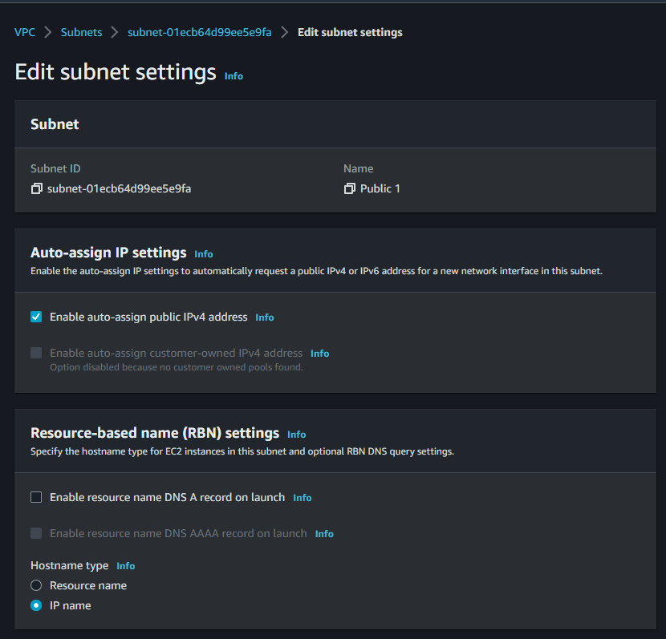

### Create an Internet Gateway:
An Internet gateway is a horizontally scaled, redundant, and highly available VPC component that allows communication between instances in your VPC and the Internet. It therefore imposes no availability risks or bandwidth constraints on your network traffic.

An Internet gateway serves two purposes: to provide a target in your VPC route tables for Internet-routable traffic, and to perform network address translation (NAT) for instances that have been assigned public IPv4 addresses.

* Choose "Create an Internet Gateway"
* Name tag = My IG
* Choose Create Internet Gateway
* Go to Actions Drop down and Choose "Attach to VPC"
* Select My VPC
* Choose Attach internet gateway

This attaches the Internet gateway to the VPC. Even though I created an Internet gateway and attached it to my VPC, you still have to tell instances within your public subnet how to get to the Internet.

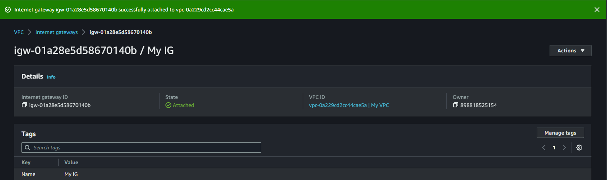

### Create a Route Table, Add Routes, And Associate Public Subnets
A route table contains a set of rules, called routes, that are used to determine where network traffic is directed. Each subnet in your VPC must be associated with a route table; the table controls the routing for the subnet. A subnet can only be associated with one route table at a time, but you can associate multiple subnets with the same route table.

To use an Internet gateway, your subnet’s route table must contain a route that directs Internet-bound traffic to the Internet gateway. You can scope the route to all destinations not explicitly known to the route table (0.0.0.0/0 for IPv4 or ::/0 for IPv6), or you can scope the route to a narrower range of IP addresses; for example, the public IPv4 addresses of your company’s public endpoints outside of AWS, or the Elastic IP addresses of other Amazon EC2 instances outside your VPC. If your subnet is associated with a route table that has a route to an Internet gateway, it’s known as a public subnet.

* Create a route table for internet-bound traffic
* Add a route to the route table to direct internet-bound traffic to the internet gateway
* Associate the public subnet with the route table.

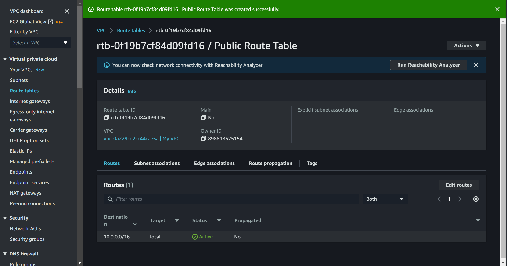

Add a route to enable public traffic

* Click Edit Routes
* Add route
* Destination = 0.0.0.0/0
* Target = Choose the Internet Gateway ID from the My IG

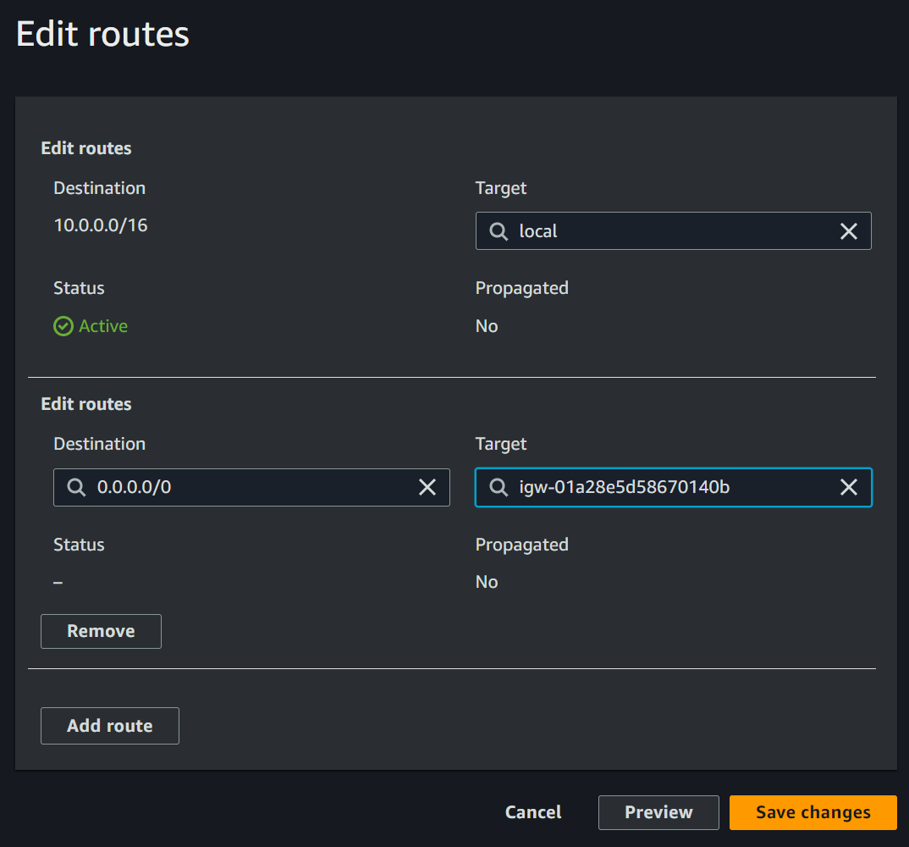

* Choose the "Subnet Associations" tab
* Edit Subnet Assocations
* Select Subnet Public 1
* Save

We have now built our route table and associated it with the public subnet.

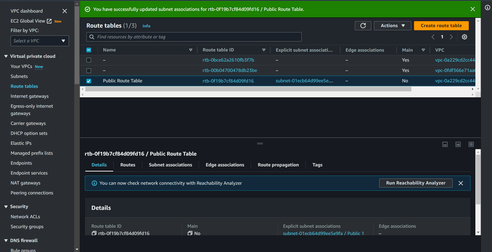

### Create a Security Group for your Web Server
A security group acts as a virtual firewall for your instance to control inbound and outbound traffic. When you launch an instance in a VPC, you can assign up to five security groups to the instance. Security groups act at the instance level, not the subnet level. Therefore, each instance in a subnet in your VPC could be assigned to a different set of security groups. If you do not specify a particular group at launch time, the instance is automatically assigned to the default security group for the VPC.

* Click on Security Groups
* Create security group
* Name = Web Server
* Description = My Web Server Security Group
* VPC = My VPC
* Inbound Rules, click Add Rule
* Type = HTTP
* Source = Anywhere-Ipv4
* Click create security group

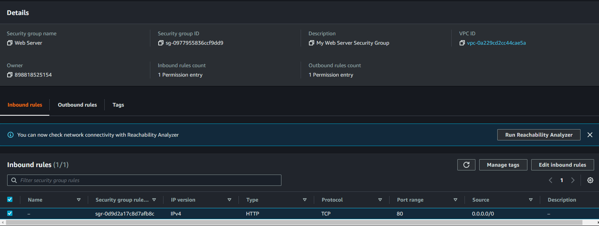

### Launch a Web Server within the Public Subnet:
* Go to EC2
* Launch Instances
* Name and Tags = Web Server
* AMI = Amazon Linux 2 AMI
* Proceed without a key pair
* Network Settings Click Edit
    - VPC = My VPC
    - Firewall (security groups) = Select an existing security group
    - Common Security Groups = Web Server
* Expand Advanced Details
* Enter the following script into the User Data text box
```
#!/bin/bash -ex
yum -y update
yum -y install httpd php mysql php-mysql
chkconfig httpd on
service httpd start
cd /var/www/html
wget https://us-west-2-aws-training.s3.amazonaws.com/courses/spl-13/v4.2.27.prod-ce5abbb0/scripts/app.tgz
tar xvfz app.tgz
chown apache:root /var/www/html/rds.conf.php
```

This script is run the first time the instance is launched. It installs a web server on your EC2 instance, and runs an app that can be configured to point to your MySQL RDS instance. After you configure your RDS instance, it presents an address book that you can edit.

* Launch Instance
* View All Instances

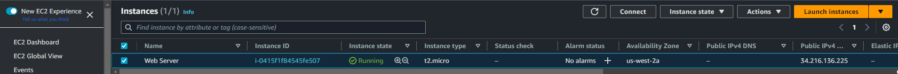

### Create Private Subnet 1 for MySQL Server:
* Go to VPC console
* Click Subnets ---> Create Subnet
* VPC = My VPC
* Subnet Name
* Select First AZ
* IPv4 CIDR = 10.0.2.0/24
* Create Subnet

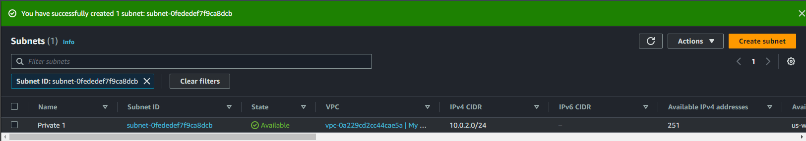

### Create Private Subnet 2 for MySQL Server:
* Go to VPC console
* Click Subnets ---> Create Subnet
* VPC = My VPC
* Subnet Name 2
* Select Second AZ
* IPv4 CIDR = 10.0.3.0/24
* Create Subnet

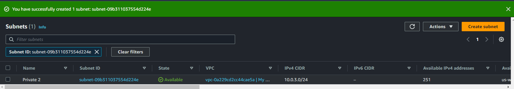

### Create a Security Group for the Database Server:
Now that the private subnets are configured, you secure the types of traffic that can access the MySQL database. I need to create a security group to only allow MySQL traffic from my Web server.

* Navigate to Security Group in VPC console
* Click Create Security Group
* Name = Database
* Description = My DB Security Group
* Choose My VPC
* Inbound
    - Add Rule
    - Type = MySQL/Aurora
    - Custom = Paste Security Group ID from Web Server SG

This allows the web server to communicate with the database.
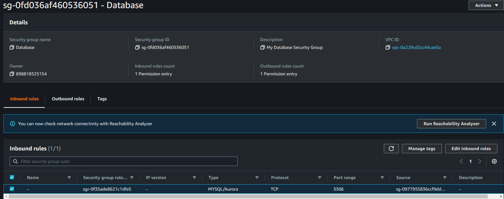

### Create a Database Subnet Group:
Amazon RDS instances require a database subnet group. A DB subnet group is a collection of subnets (typically private) that you create in a VPC and that you then designate for your DB instances. Each DB subnet group should have subnets in at least two Availability Zones in a given region. When creating a DB instance in a VPC, you must select a DB subnet group.

* Go to RDS management console
* Subnet groups
* Create DB Subnet Group
* Name = My Subnet Group
* Description = My Subnet Group
* VPC = My VPC
* Add Subnets:
    - Select first and second AZ on the list
* Choose your CDIR blocks
* Create Subnet

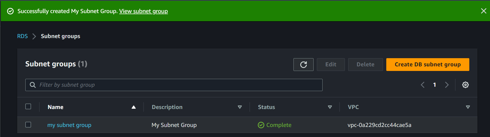

### Create an Amazon RDS Database:

* Choose Create Database
* Engine Options = MySQL
* Version = MySQL 5.7.X
* Templates Section, select Dev/Test
* Settings:
    - DB Instance Identifier = myDB
    - Enter credentials
* DB Instance Class:
    - DB instance class: Burstable classes
    - Select db.t2.micro or db.t3.micro
    - In the Storage section, de-select  Enable storage autoscaling
* Connectivity Section:
    - Virtual Private Cloud (VPC): My VPC
    - Public access:  No
    - Existing VPC security groups:
        - Add the Database security group
        - Remove the default security group
* In the Monitoring section, de-select  Enable Enhanced monitoring
* Additional Configuration:
    - Initial database name: myDB
    - De-select  Enable automated backups This turn off backups, which launches the database a little bit quicker for your lab.
    - De-select  Enable auto minor version upgrade
* Click Create Database

Wait for the DB to finish creating:

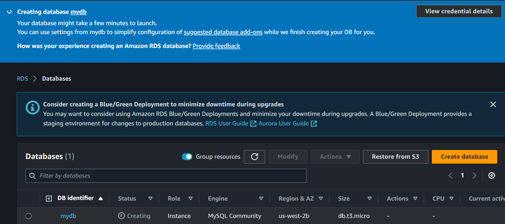

We can see that the VPC configuration with the database was successful as it shows the status as now available.

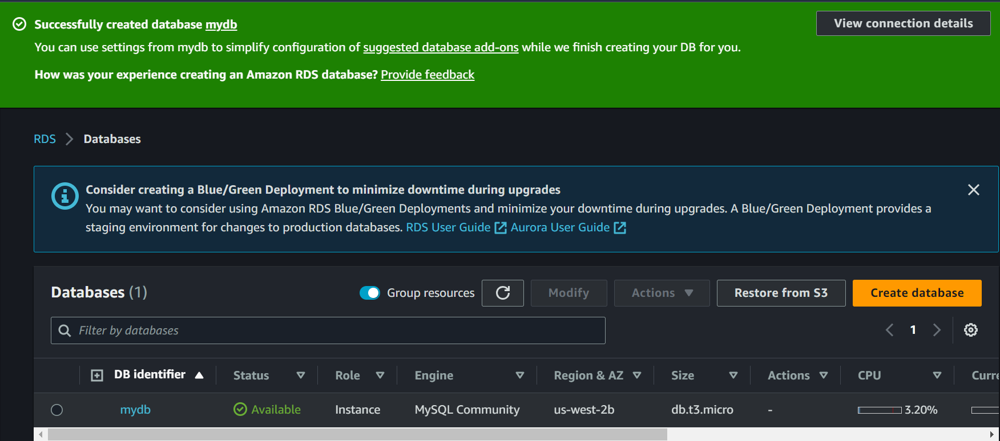