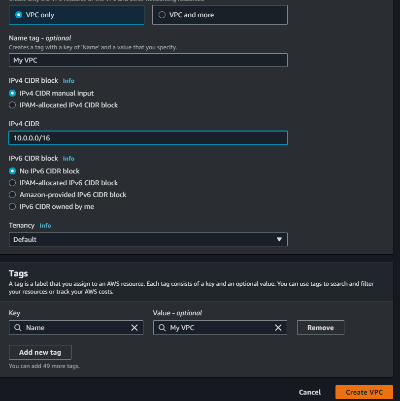

# Building-an-Amazon-Virtual-Private-Cloud-VPC-Empowering-Secure-and-Scalable-Infrastructure-with-AWS

## Author:
Alex Navarro - Senior Business Intelligence Engineer

## 🔗 Contact Information

## Project Overview:
Build a VPC that includes a web server and an Amazon RDS database. Once both are created, connect the address book application running the web server to the Amazon RDS for MySQL instance. Upon successful configuration of the address book application with the RDS instance, we will be able to add and remove contacts from the address book.

## What is Amazon VPC?
https://docs.aws.amazon.com/vpc/latest/userguide/what-is-amazon-vpc.html

## What is a Classless Inter-Domain Routing "CIDR"?
The CIDR block represents the IP address range that I can assign to my VPC. It specifies the network address and the number of significant bits used for routing within that network. It enables resources in my the VPC to communicate with each other, and with resources over the internet.

https://docs.aws.amazon.com/vpc/latest/userguide/vpc-ip-addressing.html

### Create a VPC:
* Go to the VPC management console
* Create VPC
* Choose VPC Only
* Give VPC Name
* IPv4 CIDR Block = 10.0.0.0/16
* Click Create VPC:

We can see that my VPC has been created and now we can see the details configured for this specific VPC:

### Create Public Subnet:
Remember that public subnets allow our vpc to talk to the internet. Therefore, we need to make sure that our public subnet has a internet gateawy and auto assigned public IPv4 or IPv6. We also will need to create a public subnet routing table.

* Choose Create Subnet
* VPC ID = My VPC
* Subnet Name = Public 1
* AZ = Select first AZ
* IPv4 CIDR Block = 10.0.1.0/24

We can see the subnet has been created and shows the configuration details mentioned above:

Automatically request a public IPv4 address for a new network interface.

* Enable auto-assign public IPv4 address provides a public IPv4 address for all instances launched into the selected subnet.

    * Go to the Actions drop down then select "Edit Subnet Settings"
    * Enable auto-assign public IPv4 address
    * Choose Save

### Create an Internet Gateway:
An Internet gateway is a horizontally scaled, redundant, and highly available VPC component that allows communication between instances in your VPC and the Internet. It therefore imposes no availability risks or bandwidth constraints on your network traffic.

An Internet gateway serves two purposes: to provide a target in your VPC route tables for Internet-routable traffic, and to perform network address translation (NAT) for instances that have been assigned public IPv4 addresses.

* Choose "Create an Internet Gateway"
* Name tag = My IG
* Choose Create Internet Gateway
* Go to Actions Drop down and Choose "Attach to VPC"
* Select My VPC
* Choose Attach internet gateway

This attaches the Internet gateway to the VPC. Even though I created an Internet gateway and attached it to my VPC, you still have to tell instances within your public subnet how to get to the Internet.

